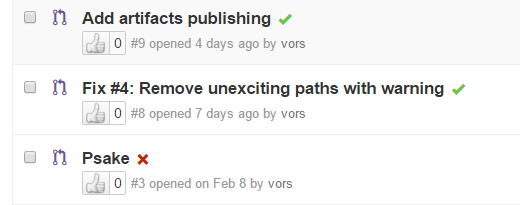

# Contribute to DscResources repository

Hi there! We're thrilled that you'd like to contribute to this project. Your help is essential to keeping it great. 

## Contributing to existing resources

### Contributing to documentation
One of the easiest ways to contribute to a PowerShell project is by helping to write and edit documentation. 
All of our documentation hosted on GitHub is written using [GitHub Flavored Markdown](https://help.github.com/articles/github-flavored-markdown/) in the style of [this example](DscResourcesExampleHelp.md).
Please make sure to also follow our [style guidelines](TODO) when writing documentation. 

To [edit an existing file](https://help.github.com/articles/editing-files-in-another-user-s-repository/), simply navigate to it and click the "Edit" button. 
GitHub will automatically create your own fork of our repository where you can make your changes. 
Once you're finished, save your edits and submit a pull request to get your changes merged upstream. 

If you want to contribute new documentation, first check for [issues tagged as "Documentation"](https://github.com/PowerShell/DscResources/labels/documentation) to make sure you're not duplicating efforts.
If no one seems to be working on what you have planned, create a fork of our repository and start adding new files to it.

### Improving test coverage for existing resources

All DSC modules in the DscResources should have tests written using [Pester](https://github.com/pester/Pester) included in a Tests folder. 

One of the most effective ways to report a bug is to provide a Pester test that fails. 
It dramatically simplifies work for the person who will fix it, increases code coverage, and prevents regressions in the future.

### Creating a new resource in an existing module

If you would like to add a DSC resource:
* Open an issue in the module repository where you'd like to add a DSC resource to coordinate your work with others.
* Fork the the module repository you'd like to improve. 
* Use *dev* branch as a baseline for work (`git checkout dev; git checkout -b my_awesome_resource`).
* In your own forked branch, add and develop your new resources. Make sure you:
    - Write pester tests.
    - Write documentation using GitHub Flavored Markdown 
    - Write (or alter) an example configuration in the Examples subdirectory demonstrating how your resource should be used
    - DO NOT change the *.psd1 ModuleVersion (we will be updating this before releasing to the Gallery)

## Contributing a new DSC resource module

If you would like to share your DSC resource module or create a brand new module, first [open an issue](https://github.com/PowerShell/DscResources/issues) with following information:

Use template from [DscResource.Template folder](DscResource.Template) which provides boilerplate files like [appveyor.yml](appveyor.yml) for CI integration.

* What system will your DSC resources be managing?
    - For example, [xActiveDirectory](https://github.com/powershell/xActiveDirectory) models and manages Active Directory
* Will your module include [MOF-based resources](TODO) (compatible with PS/WMF 4.0 and 5.0+) or [class-based resources](TODO) (only compatible with PS/WMF 5.0+)

Next, develop your resources in your own module repository. Make sure you:

* Write a set of test cases specific to your resources using pester. Place them in a `Tests` directory.
* Run all common tests located in [DSCResource.Tests](https://github.com/PowerShell/DscResource.Tests)

Follow up in the opened issue to discuss ownership strategy with PowerShell team.
The are two options:
* Transfer ownership to PowerShell organization.
* Fork your repository in PowerShell organization.

PowerShell team will include repo (or fork) as a git submodule to [DscResources](https://github.com/PowerShell/DscResources).

## AppVeyor

We use [AppVeyor](http://www.appveyor.com/) as a continious integration system.
AppVeyor builds and runs tests on every Pull Request and provides quick feedback about it.

## Common Tests
There are common dsc resources tests. 
They primarly concentrate on things like code style, encoding, modules versions consistency.
`appveyor.yml` file (describes build / test sequence for CI).
It include step to get the latest [DSCResource.Tests](https://github.com/PowerShell/DscResource.Tests) runs them as part of all tests.

## Style guidelines

When contributing to any PowerShell repositories, please follow the following guidelines: 

* For all indentation, use 4 spaces instead of tab stops
* Make sure all files are encoding using UTF-8. 
* Windows handles [newlines](http://en.wikipedia.org/wiki/Newline) using CR+LF instead of just CR. 
For interoperability reasons, we recommend that you follow [these instructions](GettingStartedWithGitHub.md#setup-git) when installing Git on Windows so that newlines saved to GitHub are simply CRs. 
* When writing Markdown, if a paragraph includes more than one setence, end each sentence with a newline.
GitHub will still render the sentences as a single paragraph, but the readability of `git diff` will be greatly improved. 

## Branches structure

We are using [git flow](http://nvie.com/posts/a-successful-git-branching-model/) model for development.
We recommend that you create local working branches that target a specific scope of change. 
Each branch should be limited to a single feature/bugfix both to streamline work flow and reduce the possibility of merge conflicts.
Please, read this excellent [overview of git flow](http://nvie.com/posts/a-successful-git-branching-model/) for more information (20 minutes reading).

