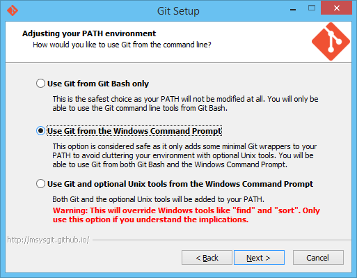
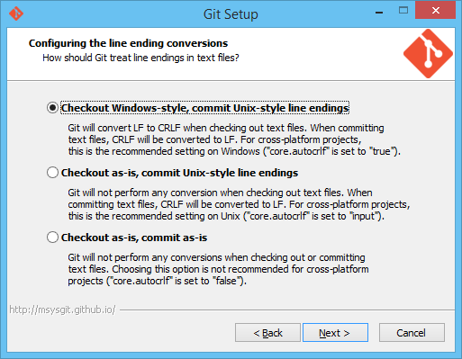

## Register on Github

[Create](https://github.com/join) GitHub account:


## Install git
Download and install git for win from the [official web-site](http://git-scm.com/download/win).

During install:

1. Choose "Use git from the Windows command prompt".


2. Choose "Checkout Windows-style, commit Unit-style line endings"


You will have two option for git command line: "powershell.exe" or "git bash". Open one of them.

1. If you use `powershell.exe`, you may want to install [posh-git](https://github.com/dahlbyk/posh-git) module (adds tab-completion and branch name to prompt).
2. Git command line often ask for interactive input, which makes powershell_ise.exe bad choice for git command line (has native tab-completion and branch name in prompt out-of-the-box). 
**Warning**: git bash is based on MINGW32, so you need to use linux-style paths. 
I.e. `cd /c/Windows`, instead of `cd c:\Windows`. 

## Setup git

Now you need to setup your name and email global settings.

```
git config --global user.name "YOUR NAME"
git config --global user.email "YOUR EMAIL ADDRESS"
```

And settings for line endings

```
git config --global core.autocrlf true
```

## Setup ssh key
To avoid typing username and password all the time, 
you may [setup ssh-key authentication](https://help.github.com/articles/generating-ssh-keys/) for you github account.
This setup is per machine.
