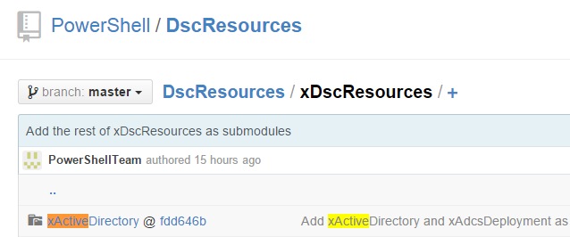
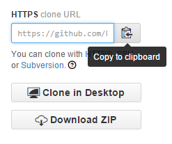
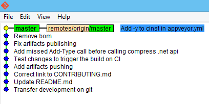
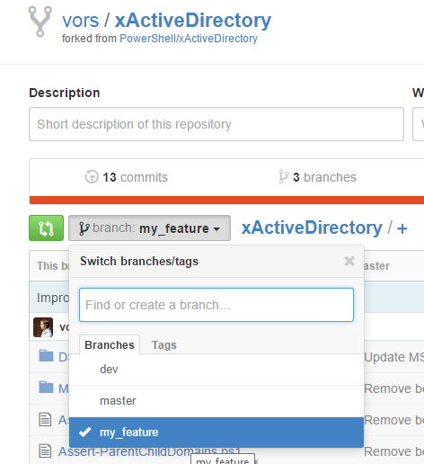

## Register on Github

[Create](https://github.com/join) GitHub account:


## Install git
Download and install git for win from the [official web-site](http://git-scm.com/download/win).

During install:

1. Choose "Use git from the Windows command prompt".


2. Choose "Checkout Windows-style, commit Unit-style line endings"


You will have two option for git command line: "powershell.exe" or "git bash". Open one of them.

1. If you use `powershell.exe`, you may want to install [posh-git](https://github.com/dahlbyk/posh-git) module (adds tab-completion and branch name to prompt).
2. Git command line often ask for interactive input, which makes powershell_ise.exe bad choice for git command line (has native tab-completion and branch name in prompt out-of-the-box). 
**Warning**: git bash is based on MINGW32, so you need to use linux-style paths. 
I.e. `cd /c/Windows`, instead of `cd c:\Windows`. 

## Setup git

Now you need to setup your name and email global settings.

```
git config --global user.name "YOUR NAME"
git config --global user.email "YOUR EMAIL ADDRESS"
```

And settings for line endings

```
git config --global core.autocrlf true
```

## Setup ssh key
To avoid typing username and password all the time, 
you may [setup ssh-key authentication](https://help.github.com/articles/generating-ssh-keys/) for you github account.
This setup is per machine.


## Clone repository from GitHub

Open GitHub repository of a module. 
To find, it you can go to all [`xDscResources`](xDscResources) or search in [PowerShell GitHub org repos](https://github.com/PowerShell).

I.e. if you want to contribute to **xActiveDirectory** you can do the following

* Find module



* Click on hyperlink to go to corresponding GitHub repo


* Copy **url** from the browser or copy it from the GitHub UI on the right




* In PowerShell, run command:

```
git clone <url>
```

i.e.

```
git clone https://github.com/PowerShell/xActiveDirectory
```

* Git will create a new directory with corresponding name (i.e. `xActiveDirectory`).

## Securely storing git credentials
We recommend installing [Git Credential Manager for Windows](https://github.com/Microsoft/Git-Credential-Manager-for-Windows) or [Git Credential Manager for Mac and Linux](https://github.com/Microsoft/Git-Credential-Manager-for-Mac-and-Linux) in order to securely store git credentials and not have to provide them everytime you perform git operation.

## Forking a repository on GitHub

To send changes from you local machine, you would first need to upload them to your **fork** of our repo.
Use fork button on the right side of repo GitHub page.


## Adding the fork as a remote on the local machine

You would need to add your fork as a [remote](http://git-scm.com/book/en/v2/Git-Basics-Working-with-Remotes) to send changes there.
* Get fork url (same way as original repo url, open fork GitHub page in browser and copy from it).
* Run `git remote add my <url>`, i.e. `git remote add my https://github.com/vors/xActiveDirectory`.
* Check correctness with `git remote -v`

```
> git remote -v
my	https://github.com/vors/xActiveDirectory (fetch)
my	https://github.com/vors/xActiveDirectory (push)
origin	https://github.com/PowerShell/xActiveDirectory (fetch)
origin	https://github.com/PowerShell/xActiveDirectory (push)
```

* Now you have two remote references: **origin** to the original repository and **my** to your fork.

## Making changes and pushing them to the fork

* To make changes, create a new local branch: `git checkout -b <branch> my/dev`, i.e. `git checkout -b awesome_feature my/dev`. 
This will create a new local branch, connect to your fork's dev branch as the tracking branch (upstream branch) and then checkout (move) to the new branch.
* To see all branches, run `git branch -a`
* To see status of all branches (if they are ahead or behind the tracking branch) , run `git branch -v`
```
> git branch -a
* master
  remotes/origin/HEAD -> origin/master
  remotes/origin/master
```
Active branch is marked with `*`.
`-a` flag tells git to show both [**local**](http://git-scm.com/book/en/v2/Git-Branching-Basic-Branching-and-Merging) and [**remote**](http://git-scm.com/book/en/v2/Git-Branching-Remote-Branches) branches.

* make you changes and **commit** them with `git commit -a -m "<Commit message>"`.
`-a` flag tells git to include all modified files in commit.
`-m` flag specifies the commit message.

* To get the big picture of current state of your repository, use `gitk --all` command. It opens a UI with a lot of usefull information. You can read more about **gitk** [here](https://lostechies.com/joshuaflanagan/2010/09/03/use-gitk-to-understand-git/).



* After that can **push** changes to your fork with `git push my <branch>` command, i.e. `git push my awesome_feature`.

## Sending pull request
 
Now you should be able to see your branch in your fork on GitHub



You can create a new pull request on the same page


Follow instructions from [pull request lifecycle](CONTRIBUTING.md#lifecycle-of-a-pull-reqeust) to finish Pull request creating.

## Updating pull request

To update Pull Request, simply push more commits to the same branch in your GitHub fork, that you use to create the pull request.

```
git commit -a -m "Update my awesome feature with codereview feedback"
git push my awesome_feature
```

GitHub would automatically update the pull request.

## Resolve merge conflicts

If another pull request is merged while yours is in review, you will need to add those new changes into your working branch before your pull request is allowed to merge. To do this we will 'rebase' the branch.
This means that the changes you made in your working branch for your pull request will be 'replayed' on top of the changes that were recently merged into dev, as though you originally created your branch/fork from the current point that the dev branch is at.  
_Note: Since it's replayed you might get conflicts several times during the rebase process (for the first `rebase` command, and for each following `rebase --continue`)._

Here are the steps to rebasing your branch:  
**_Note: These steps require that you have added the remote as described above. Run `git remote -v` to verify that you have the remotes `my` pointing to your fork repository and `origin` pointing to the original repository._**

1. Rebase the local dev branch from the base dev branch.
2. Resolve merge conflicts.
3. Rebase your working branch.
4. Resolve merge conflicts.
5. Update your pull request.

### 1. Rebase the local dev branch from the base dev branch 
* In a PowerShell prompt, you need to do the following.

```
cd <path to cloned repository>      # This is the path to your cloned repository. I.e. cd C:\Source\xActiveDirectory
git checkout dev                    # Checkout (move) to your local dev branch.
git fetch origin dev                # Get all changes from origin/dev (and branch information). 
git rebase origin/dev               # Rebase changes from origin/dev into your local dev branch.
```
**NOTE! You can get merge conflicts that need to be resolved before you continue with the next step of rebasing your working branch. Search for the word 'CONFLICT' in the output. See step 3 to learn how to resolve the merge conflicts.**

Force push to your fork's dev branch to your forked repository. _Make sure all conflicts are resolved before running this command._
```
git push my dev --force  
```

### 2. Rebase your working branch.
* In a PowerShell prompt, you need to do the following.

```
cd <path to cloned repository>      # This is the path to your cloned repository. I.e. cd C:\Source\xActiveDirectory.
git checkout <your PR branch>       # Checkout (move) to your working branch, i.e git checkout awesome_feature.
git rebase my/dev                   # This will rebase your working branch from your forks dev branch.
```
**NOTE! At this point you will most likly get merge conflicts that need to be resolved before you continue with the next step. Search for the word 'CONFLICT' in the output. See step 3 to learn how to resolve the merge conflicts.**

### 3. Resolve merge conflicts
If you get a message saying something like below, then you have merge conflicts that must be manually resolved.
Below there is a conflict between the dev branch and your pull request branch for the file `README.md`.  
You can read more about how to resolve a merge conflict on the [GitHub help page](https://help.github.com/articles/resolving-a-merge-conflict-from-the-command-line/).

```
Auto-merging README.md
CONFLICT (content): Merge conflict in README.md
error: Failed to merge in the changes.
```

To fix this you need to manually open the file in an editor of your choosing and find the conflict. You find the conflict by searching for seven equals sign: `=======`.  
Below is an example of how it could look like. 

```
...
### Unreleased
<<<<<<< HEAD
* Added tests for resources
  - xSQLServerPermission
* Fixes in xSQLServerAvailabilityGroupListener
  - In one case the Get-method did not report that DHCP was configured. 
=======
* Added resources
  - xSQLServerReplication
>>>>>>> my/dev

### 1.8.0.0
...
```

* Above the equals sign `========` is what's in the `README.md` of your branch.
* Below the equals sign `========` is what's in the `README.md` of the dev branch.

To resolve this we have to manually change this section. After resolving the conflict, `README.md` looks like this:  
_Note: You must remove the lines `<<<<<<< HEAD`, `========` and `>>>>>>> origin/dev`._

```
...
### Unreleased
* Added resources
  - xSQLServerReplication
* Added tests for resources
  - xSQLServerPermission
* Fixes in xSQLServerAvailabilityGroupListener
  - In one case the Get-method did not report that DHCP was configured. 

### 1.8.0.0
...
```

When you are happy with the file, save it and continue with the next file, if there was more merge conflicts. **Only when all the merge conflicts are resolved can you continue with the rebase.**

* To continue with the rebase. In the same PowerShell prompt as you started the rebase, you need to do the following.  
_Note: If not using the same PowerShell prompt, make sure you are in the right folder and on the right branch._
```
git status          # (optional) If you unsure of the name, you can use this to see the files that was in conflict.
git add <file>      # Do this for each file that you fixed merged conflicts in. I.e 'git add README.md'. This stages the file for commit. You could also use 'git *' to stage all files at once.
git rebase --continue
```

**You can now get more merge conflicts.** If so, then you have to resolve those again. Do the same procedure as before for these new conflicts. **You might need to do this step several times.**  

Continue to step 4 only when you no longer have any merge conflicts you need to resolve (and no longer need to run the command `rebase --continue`).

### 4. Update your pull request
Force push to your branch in your forked repository. The pull request will then be updated automatically by GitHub.
```
git push my <pull request branch> --force     # I.e git push my awesome_feature --force  
```

## Delete a branch

Once your changes have been successfully merged into the hub repository you can delete the branch you used, as you will no longer need it.  
Any further work requires a new branch.  
To delete your branch follow these steps:

1. Run `git checkout master` in the command prompt.  This ensures that you aren't in the branch to be deleted (which isn't allowed).
2.	Next, type `git branch -d <branch name>` in the command prompt.  This will delete the branch on your local machine only if it has been successfully merged to the upstream repository. (You can override this behavior with the `–D` flag, but first be sure you want to do this.)
3.	Finally, type `git push my :<branch name>` in the command prompt (a space before the colon and no space after it).  This will delete the branch on your github fork.  

## Using .gitignore to exclude files and/or folders
There are cases when you need to add some files and/or folders to a .gitignore file so changes are not staged for commit. One example is the folder `DSCResource.Tests` that is generated when running tests. This folder should normally not be part of any PR.

### Create a .gitgnore file
Run the following in a PowerShell prompt. This will add a .gitignore file to the current folder.
```
@( 
    ".gitignore",        # Excludes the .gitignore file itself
    "DSCResource.Tests", # Excludes the folder that is generated when running tests
    ".vs",               # Excludes Visual Studio settings folder
    ".vscode"            # Excludes Visual Studio Code settings folder
) | Out-File -LiteralPath '.gitignore' -Encoding utf8 -Force 
```

Make sure this `.gitignore` file is placed in the root of your cloned repository.

### How to continue working on a pull request when an author (contributor) is unable to complete it
If the original contributor is unable to continue the work on a pull request, or if the pull request is abandoned for a long time, then there is a possibility for you to continue the work.
You can do so by getting the changes from the original contributors branch to a new working branch in your fork. Once you have create a new working branch with the original contributors changes,
then you can create a new pull request into the original repository.   
It's important that when you create a new pull request from someone elses work, that you mention the the original pull request, and also aknowledge the original author and mention the work it is based on.
For example mention the original author in the descriptive field when you create the new pull request.

So, to continue working on a pull request, this is done by rebasing the changes in the original pull request branch onto your new working branch. This is pretty much the same as when you have to resolve merge conflicts.  

* In a PowerShell prompt, you need to do the following.

1. Create a new working branch in your fork.
```
cd <path to cloned repository> 
git checkout -b changes-from-PR#<number>  # Change to the number of the PR you are taking over. I.e. git checkout -b changes-from-PR#34
```

2. Add a remote to the original contributors fork. _In this example we use the users name as the remotes name._
```
git remote add <username> <url>           # I.e git remote add johlju https://github.com/johlju/xSQLServer.git
```

3. Rebase your working branch using the fork and branch from the original contributor.
```
git fetch <username>
git rebase <username>/<branch>
```

4. Fix conflicts and when all conflicts are resolved stage all files and continue with the rebase. _This step might have to be done several times until all conflicts are resolved_
```
git add <file>                            # i.e git add README.md
git rebase --continue
```

5. Push changes to your forked repository 
```
git push my changes-from-PR#<number> --force  # Change to the number of the PR you are taking over. You have to use --force. I.e. git push my changes-from-PR#34 --force
``` 

6. Now we rebase again, this time against my/dev (which should already be rebased against origin/dev, see section Resolving merge conflicts on how to do that).
```
git branch -u my/dev
git rebase my/dev
```

7. Again, fix conflicts and when all conflicts are resolved stage all files and continue with the rebase. _This step might have to be done several times until all conflicts are resolved_
```
git add <file>                            # i.e git add README.md
git rebase --continue
```

8. Push to your forked repository again
```
git push my changes-from-PR#<number> --force  # Change to the number of the PR you are taking over. You have to use --force. I.e. git push my changes-from-PR#34 --force
```

9. Now, go to you forked repository on GitHub and create the pull request the normal way.
